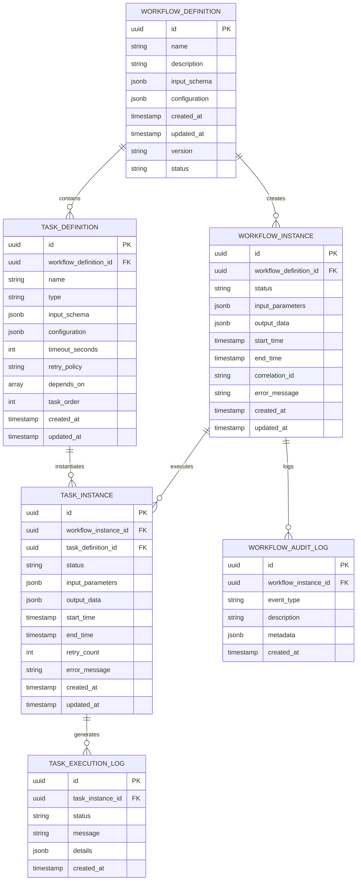

```mermaid
erDiagram
    WORKFLOW_DEFINITION ||--o{ WORKFLOW_INSTANCE : "creates"
    WORKFLOW_DEFINITION ||--o{ TASK_DEFINITION : "contains"
    WORKFLOW_INSTANCE ||--o{ TASK_INSTANCE : "executes"
    TASK_DEFINITION ||--o{ TASK_INSTANCE : "instantiates"
    TASK_INSTANCE ||--o{ TASK_EXECUTION_LOG : "generates"
    WORKFLOW_INSTANCE ||--o{ WORKFLOW_AUDIT_LOG : "logs"

    WORKFLOW_DEFINITION {
        uuid id PK
        string name
        string description
        jsonb input_schema
        jsonb configuration
        timestamp created_at
        timestamp updated_at
        string version
        string status
    }

    TASK_DEFINITION {
        uuid id PK
        uuid workflow_definition_id FK
        string name
        string type
        jsonb input_schema
        jsonb configuration
        int timeout_seconds
        string retry_policy
        array depends_on
        int task_order
        timestamp created_at
        timestamp updated_at
    }

    WORKFLOW_INSTANCE {
        uuid id PK
        uuid workflow_definition_id FK
        string status
        jsonb input_parameters
        jsonb output_data
        timestamp start_time
        timestamp end_time
        string correlation_id
        string error_message
        timestamp created_at
        timestamp updated_at
    }

    TASK_INSTANCE {
        uuid id PK
        uuid workflow_instance_id FK
        uuid task_definition_id FK
        string status
        jsonb input_parameters
        jsonb output_data
        timestamp start_time
        timestamp end_time
        int retry_count
        string error_message
        timestamp created_at
        timestamp updated_at
    }

    TASK_EXECUTION_LOG {
        uuid id PK
        uuid task_instance_id FK
        string status
        string message
        jsonb details
        timestamp created_at
    }

    WORKFLOW_AUDIT_LOG {
        uuid id PK
        uuid workflow_instance_id FK
        string event_type
        string description
        jsonb metadata
        timestamp created_at
    }
```